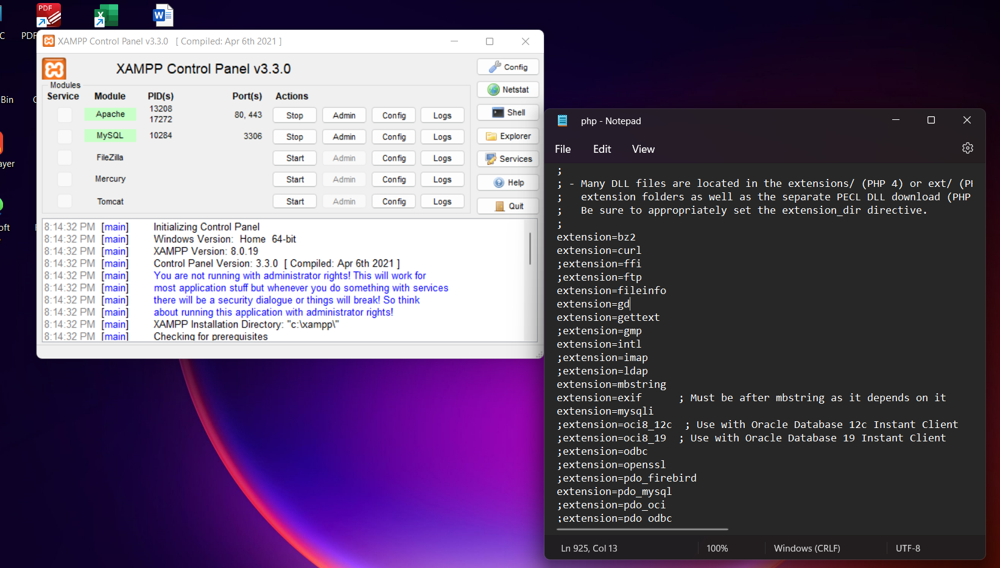
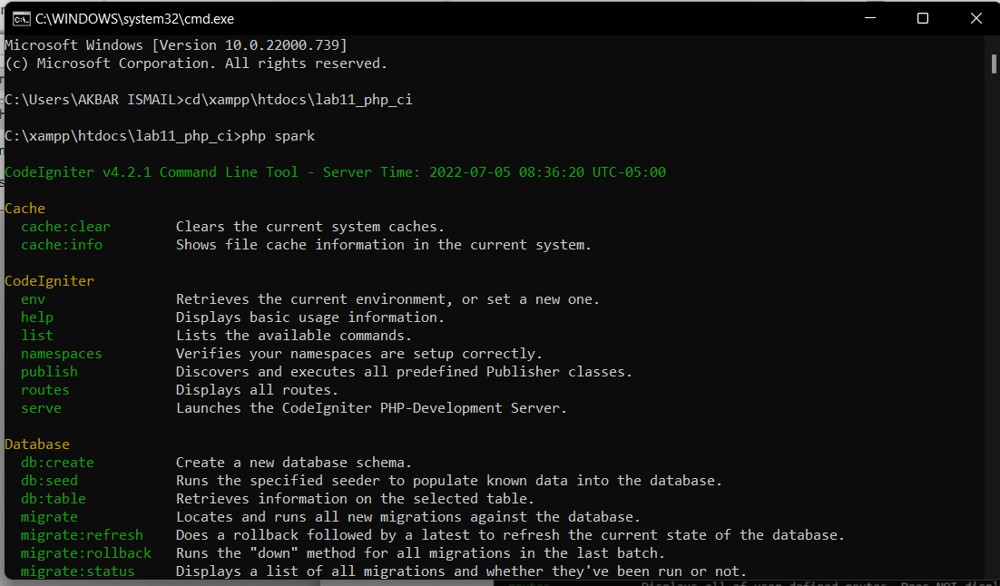
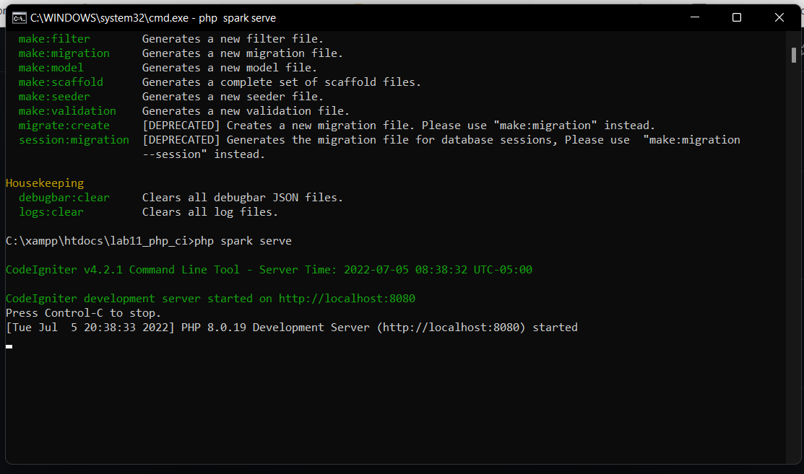
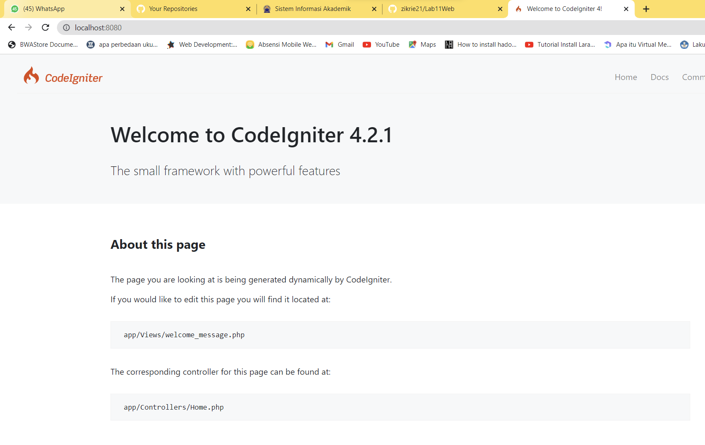
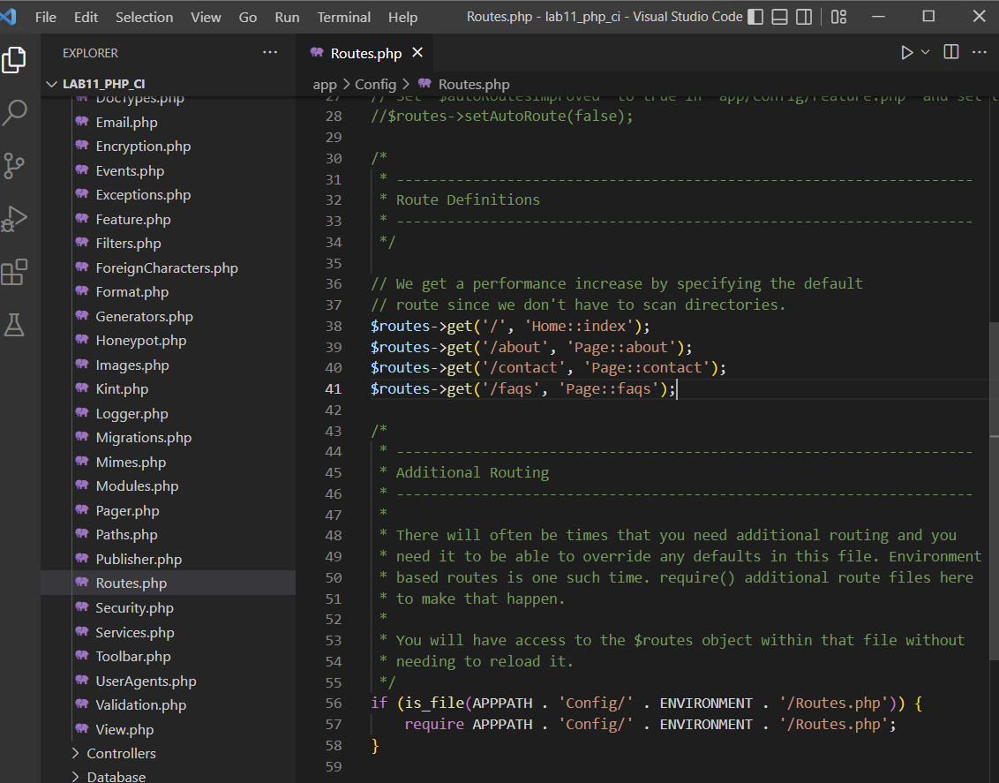
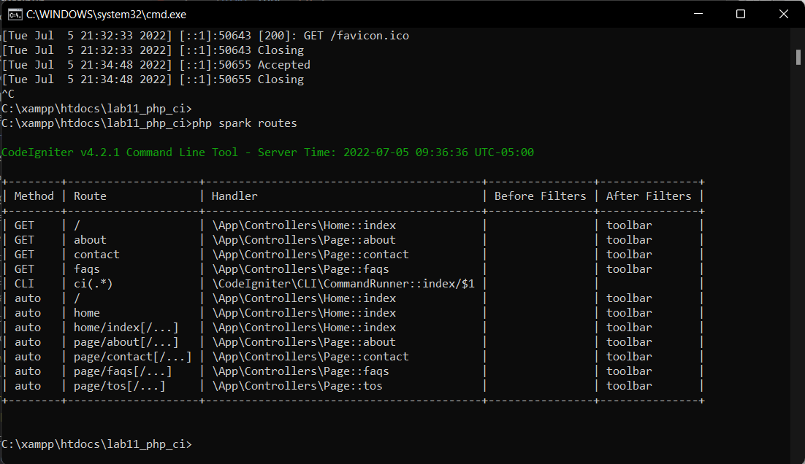

# ZIKRI HADIANSYAH - 312010069
### PHP Framework (Codeigniter)

- Langkah pertama mengaktifkan ekstentsi tersebut, melalu XAMPP Control Panel, pada bagian
Apache klik Config -> PHP.ini, seperti gambar di bawah ini :

- Jika sudah mengaktifkan, Unduh Codeigniter dari website https://codeigniter.com/download
- lalu buka CMD ketikan perintah cd/xampp/htdocs/lab11_php_ci(sesuai nama folder anda). Ketika sudah di lokasi foldernya, ketikan
perintah php spark untuk mengetahui dimana errornya saat meng run Codeigniternya. Seperti gambar dibawah ini :

- Jika sudah ketikan perintah php spark serve untuk menjalankan serve Codeignternya, seperti gambar di bawah ini :

- ini tampilan saat konek ke server codeigneternya 

- Lalu buka Folder lab11_php_ci ini ke VisualStudioCode atau text editor kalian yang biasa digunakan. Lalu konfigurasi Routesny seperti dibawa ini :

- Lalu gunakan perintah php spark routes untuk mengaktifkan routes tersebut, seperti gambar dibawah ini :

