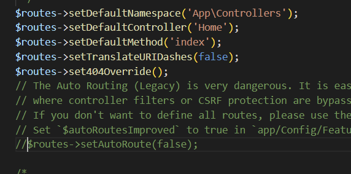
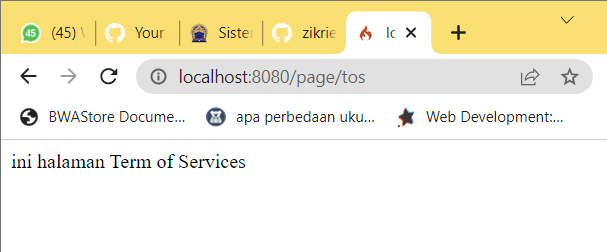
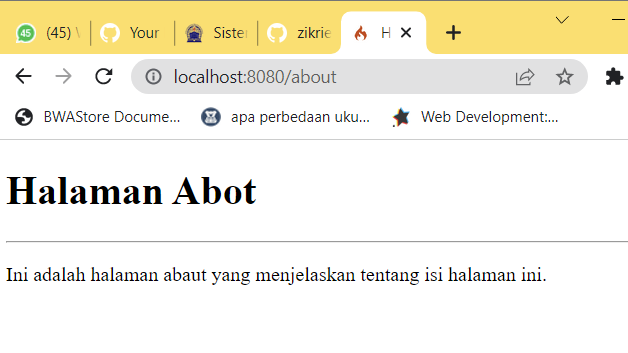

# ZIKRI HADIANSYAH - 312010069
### PHP Framework (Codeigniter)

- Langkah pertama mengaktifkan ekstentsi tersebut, melalu XAMPP Control Panel, pada bagian
Apache klik Config -> PHP.ini, seperti gambar di bawah ini :


- Jika sudah mengaktifkan, Unduh Codeigniter dari website https://codeigniter.com/download
- lalu buka CMD ketikan perintah cd/xampp/htdocs/lab11_php_ci(sesuai nama folder anda). Ketika sudah di lokasi foldernya, ketikan
perintah php spark untuk mengetahui dimana errornya saat meng run Codeigniternya. Seperti gambar dibawah ini :


- Jika sudah ketikan perintah php spark serve untuk menjalankan serve Codeignternya, seperti gambar di bawah ini :


- ini tampilan saat konek ke server codeigneternya 


- Lalu buka Folder lab11_php_ci ini ke VisualStudioCode atau text editor kalian yang biasa digunakan. Lalu konfigurasi Routesny seperti dibawa ini :


- Lalu gunakan perintah php spark routes untuk mengaktifkan routes tersebut, seperti gambar dibawah ini :


- Membuat Controller, Selanjutnya adalah membuat Controller Page. Buat file baru dengan nama page.php
pada direktori Controller kemudian isi kodenya seperti berikut.
```
<?php
namespace App\Controllers;
class Page extends BaseController
{
    public function about()
    {
    echo "Ini halaman About";
    }
    public function contact()
    {
    echo "Ini halaman Contact";
    }
    public function faqs()
    {
    echo "Ini halaman FAQ";
    }
    public function tos()
    {
    echo "ini halaman Term of Services";
    }
}
```
- Saat ke localhost about akan menampilkan page seperti dibawah ini :


- Lalu Auto Routing
Secara default fitur autoroute pada Codeiginiter sudah aktif. Untuk mengubah status
autoroute dapat mengubah nilai variabelnya. Untuk menonaktifkan ubah nilai true
menjadi false. Seperti gambar di bawah ini :


- Yang sudah diaaktifkan


- Jika sudah Tambahkan method baru pada Controller Page seperti berikut.
```
public function tos()
{
echo "ini halaman Term of Services";
}
```
- Lalu saat kita ubah ke localhost http://localhost:8080/page/tos, akan tampil seperti dibawah ini :


- Selanjutnya adalam membuat view untuk tampilan web agar lebih menarik. Buat file
baru dengan nama about.php pada direktori view (app/view/about.php) kemudian isi
kodenya seperti berikut.
```
<!DOCTYPE html>
<html lang="en">
<head>
  <meta charset="UTF-8">
  <title><?= $title; ?></title>
</head>
<body>
  <h1><?= $title; ?></h1>
  <hr>
  <p><?= $content; ?></p>
</body>
</html>
```

- Jika sudah Ubah method about pada class Controller Page menjadi seperti berikut:
```
public function about()
{
    return view('about', [
    'title' => 'Halaman Abot',
    'content' => 'Ini adalah halaman abaut yang menjelaskan tentang isi
    halaman ini.'
  ]);
}
```
- Kemudian lakukan refresh pada halaman tersebut. Akan Menampilkan seperti dibawah ini :


- Lalu tambahkan style.css yang hasil dari Praktikum 4, tambahkan ke folder public di copy paste saja

- Kemudian buat folder template pada direktori view kemudian buat file header.php dan
footer.php
File app/view/template/header.php, codingannya sperti dibawah ini :

```
<!DOCTYPE html>
<html lang="en">
<head>
    <meta charset="UTF-8">
    <title><?= $title; ?></title>
    <link rel="stylesheet" href="<?= base_url('/style.css');?>">
</head>
<body>
    <div id="container">
<header>
    <h1>Layout Sederhana</h1>
</header>
<nav>
    <a href="<?= base_url('/');?>" class="active">Home</a>
    <a href="<?= base_url('/artikel');?>">Artikel</a>
    <a href="<?= base_url('/about');?>">About</a>
    <a href="<?= base_url('/contact');?>">Kontak</a>
</nav>
<section id="wrapper">
    <section id="main">
```

- Lalu buat File app/view/template/footer.php, dengan codingan dibawah ini :
```
</section>
<aside id="sidebar">
    <div class="widget-box">
        <h3 class="title">Widget Header</h3>
    <ul>
        <li><a href="#">Widget Link</a></li>
        <li><a href="#">Widget Link</a></li>
    </ul>
</div>
<div class="widget-box">
    <h3 class="title">About Me</h3>
    <p>Hello Nama Saya ZIKRI HADIANSYAH - 312010069 saya adalah mahasiswa Teknik Informatika di Universitas Pelita Bangsa/p>
</div>
</aside>
</section>
<footer>
    <p>&copy; 2021 - Universitas Pelita Bangsa</p>
</footer>
</div>
</body>
</html>
```

- Kemudian ubah file app/view/about.php seperti berikut.
```
<?= $this->include('template/header'); ?>
<h1><?= $title; ?></h1>
<hr>
<p><?= $content; ?></p>
<?= $this->include('template/footer'); ?>
```

- Jika semua sudah dilakukan dengan benar dan secara terstruktur jika saat direfresh pada alamat http://localhost:8080/about. Akan menampilkan seperti dibawah ini :


